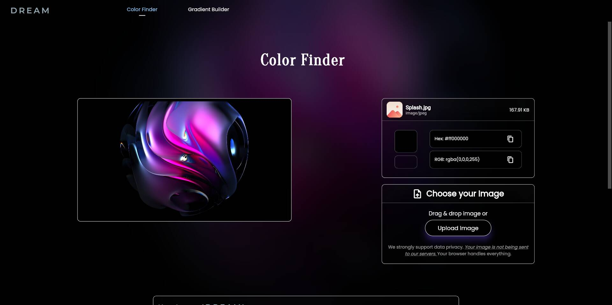
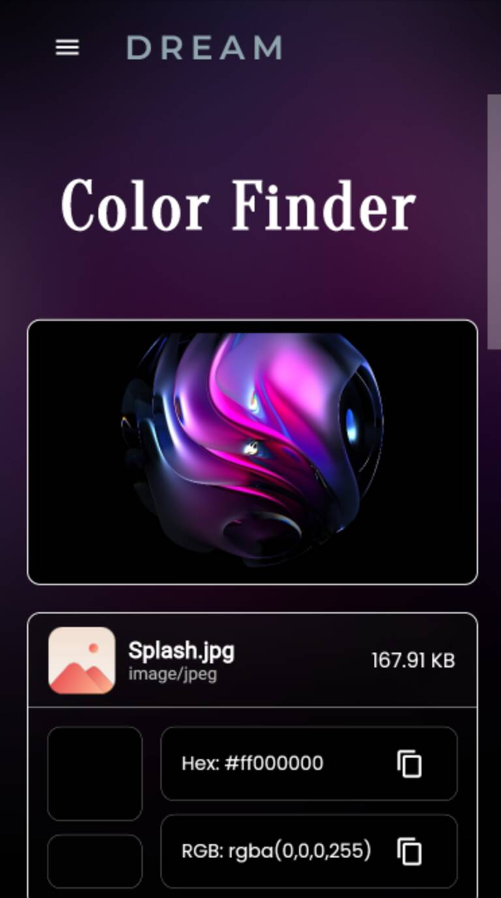
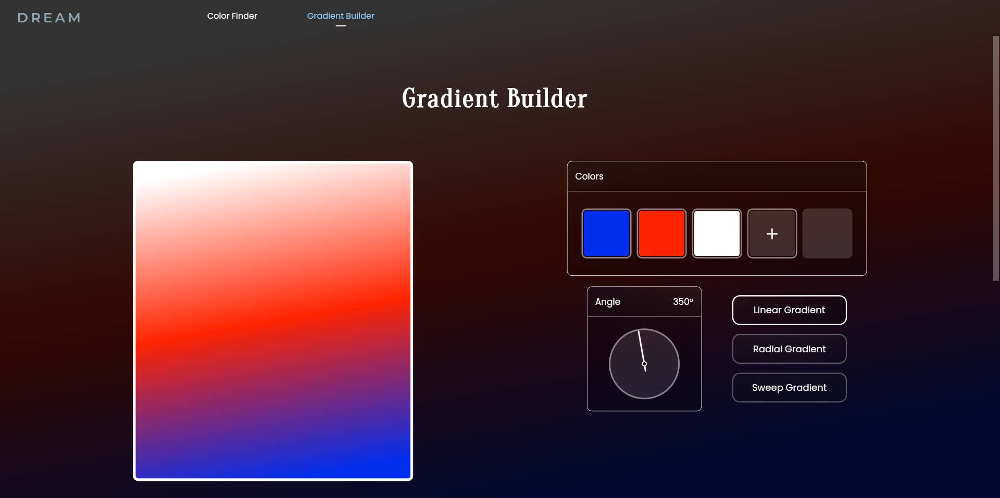
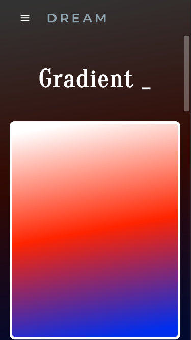

# D R E A M

Find colors from images and screenshots. Just drag & drop the image and copy the color. 
Use the gradient builder to build beautiful background for your websites. 


The project started as a vague idea and the initial thread was from my dream. 
The "DREAM" has the following features:
## ✨ Features

- 🖼️ Color finder from image
- 🛹 Drag & Drop supported
- 😲 Supports png, apng, avif, jpeg, png, webp
- 🎨 Gradient builder upto 5 colors
- 🧊 Supports transperancy
- 🧑🏻‍💻 Share code with friends
- 📱 Responsiveness


## 🖥️ Demo

Go here>>>> [View DREAM](https://chrisbinsunny.github.io/dream)
## 🚀 Deployment

To debug this project run

```bash
  flutter run -d chrome --web-renderer canvaskit --release --dart-define=BROWSER_IMAGE_DECODING_ENABLED=false
```

Due to an ongoing issue, viewing the color from the image in debug mode is not available. 

🚨 View my comment on similar [issue.](https://github.com/flutter/flutter/issues/52609#issuecomment-1283735805)
Track the issue here: [94895](https://github.com/flutter/flutter/issues/94895), & [103612](https://github.com/flutter/flutter/issues/103612).

## 🔰 To-Do

- [  ] Add color palette in color finder
- [  ] Dart code support in gradient builder
- [  ] Drag to move colors
- [  ] Add transperancy to appbar
- [  ] Innovative UI
- [  ] Live test CSS in codepen


## 📸 Screenshots

<table>
  <tr>
    <td>Color Finder- Desktop</td>
     <td>Color Finder- Mobile</td>
  </tr>
  <tr>
    <td></td>
    <td></td>
  </tr>
 </table>

<table>
  <tr>
    <td>Gradient Builder- Desktop</td>
     <td>Gradient Builder- Mobile</td>
  </tr>
  <tr>
    <td></td>
    <td></td>
  </tr>
 </table>

## 👩🏻‍💻 Contributing

Contributions are always welcome!

See `contributing.md` for ways to get started.

Please adhere to this project's `code of conduct`.


## 🔐 License

MIT License

Copyright (c) 2022 Chrisbin Sunny

Permission is hereby granted, free of charge, to any person obtaining a copy
of this software and associated documentation files (the "Software"), to deal
in the Software without restriction, including without limitation the rights
to use, copy, modify, merge, publish, distribute, sublicense, and/or sell
copies of the Software, and to permit persons to whom the Software is
furnished to do so, subject to the following conditions:

The above copyright notice and this permission notice shall be included in all
copies or substantial portions of the Software.

THE SOFTWARE IS PROVIDED "AS IS", WITHOUT WARRANTY OF ANY KIND, EXPRESS OR
IMPLIED, INCLUDING BUT NOT LIMITED TO THE WARRANTIES OF MERCHANTABILITY,
FITNESS FOR A PARTICULAR PURPOSE AND NONINFRINGEMENT. IN NO EVENT SHALL THE
AUTHORS OR COPYRIGHT HOLDERS BE LIABLE FOR ANY CLAIM, DAMAGES OR OTHER
LIABILITY, WHETHER IN AN ACTION OF CONTRACT, TORT OR OTHERWISE, ARISING FROM,
OUT OF OR IN CONNECTION WITH THE SOFTWARE OR THE USE OR OTHER DEALINGS IN THE
SOFTWARE.

